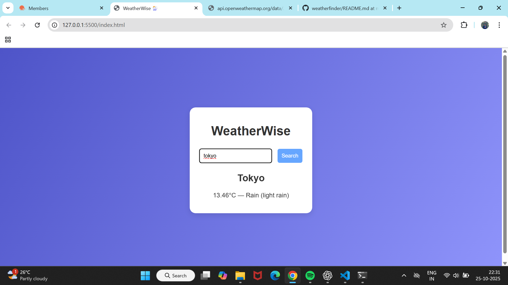
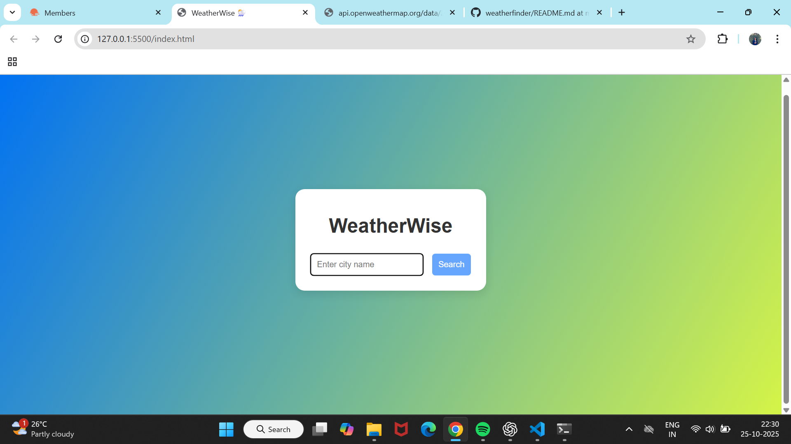
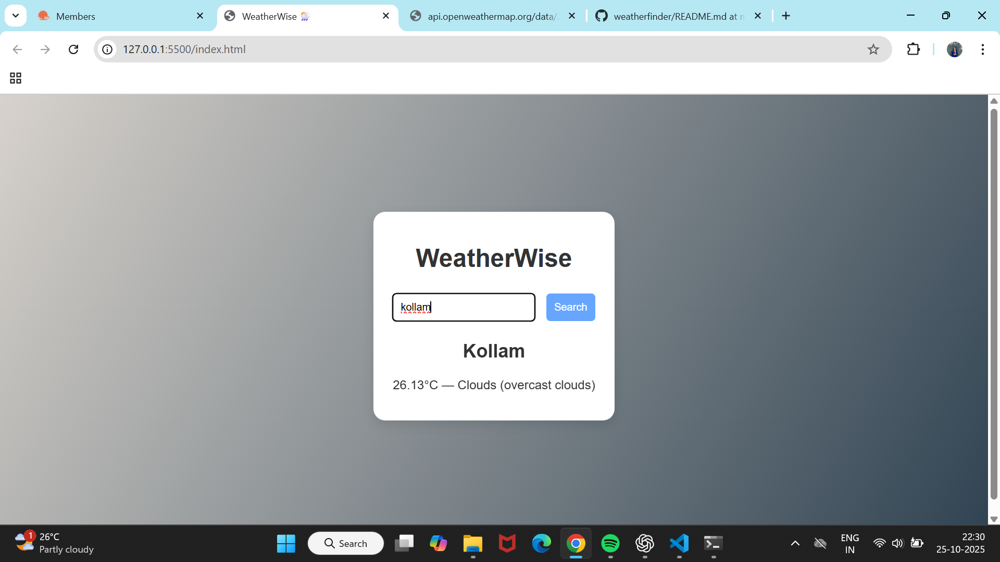
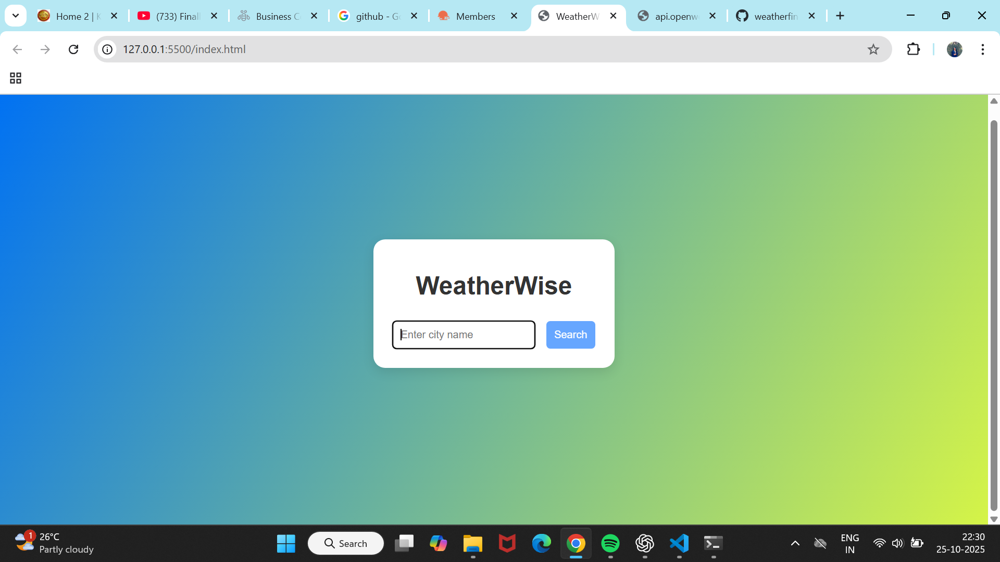

# WeatherWise 🌦️

WeatherWise is a simple web app that allows users to check the current weather of any city in real-time using the **OpenWeatherMap API**.  

It features dynamic backgrounds, error handling for invalid cities, and displays temperature, weather condition, and description.

---

## Features

- Search for any city and get its current weather
- Dynamic background based on weather conditions
- Error handling for invalid city names
- Responsive and clean UI
- Easy to extend for additional weather features

---

## Screenshots
**Screenshot**  


**Screenshot**  

**Screenshot**  


**Screenshot**  

**Screenshot**  


**Screenshot**  

**Screenshot**  



---

## Setup

1. **Clone the repository**

```bash
git clone https://github.com/aksa2018/weatherfinder.git
